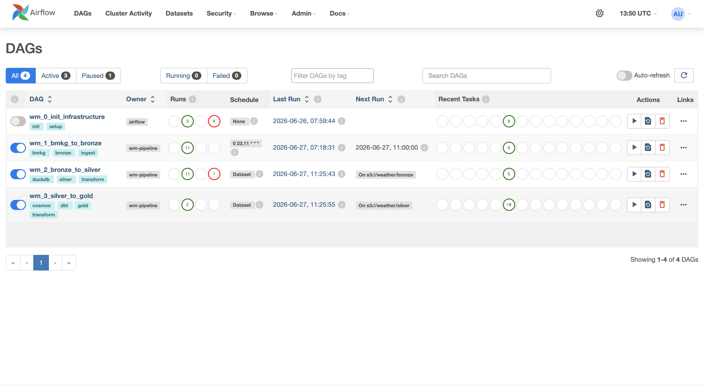
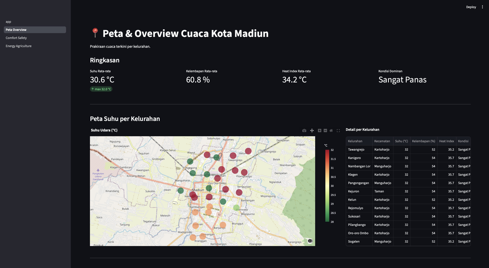
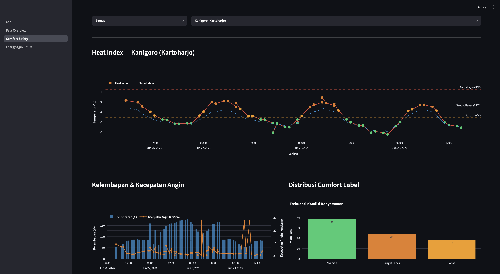
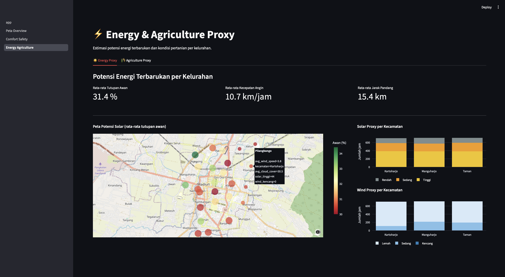

# 🌤️ Weather Madiun Pipeline

> End-to-end data engineering portfolio project — prakiraan cuaca BMKG Kota Madiun

Pipeline ini mengambil data prakiraan cuaca dari API BMKG untuk seluruh 27 kelurahan Kota Madiun, memprosesnya melalui arsitektur medallion (Bronze → Silver → Gold), dan memvisualisasikannya dalam dashboard interaktif menggunakan Airflow, RustFS, DuckDB, dbt, dan Streamlit.

---

## 📸 Screenshots

### Airflow — DAG Pipeline


### Dashboard — Peta & Overview


### Dashboard — Comfort & Safety


### Dashboard — Energy & Agriculture


---

## 🏗️ Arsitektur

```
API BMKG
   │
   ▼
[DAG 1] Fetch + Upload (2× sehari)
   │
   ▼
Bronze Layer ── RustFS (Parquet, Snappy compressed)
   │  DuckDB baca langsung via httpfs (column pushdown)
   ▼
[DAG 2] Load to Staging
   │
   ▼
Silver Layer ── DuckDB schema: staging
  └── stg_weather_forecast (~540 rows/run)
   │
   │  dbt transformasi via Astronomer Cosmos
   ▼
[DAG 3] dbt Run (8 models, 67 tests)
   │
   ▼
Gold Layer ── DuckDB schema: gold
  ├── dim_date
  ├── dim_time
  ├── dim_location         (27 kelurahan)
  ├── dim_weather_condition
  ├── fact_comfort_safety
  ├── fact_energy_proxy
  └── fact_agriculture_proxy
   │
   ▼
Streamlit Dashboard (localhost:8501)
  ├── 📍 Peta & Overview
  ├── 🌡️ Comfort & Safety
  └── ⚡ Energy & Agriculture
```

---

## 🛠️ Tech Stack

| Teknologi | Versi | Peran |
|---|---|---|
| Apache Airflow | 2.11.1 | Orchestration & scheduling |
| RustFS | latest | Bronze storage (S3-compatible, self-hosted) |
| DuckDB | 1.1.0+ | Silver + Gold layer |
| dbt-duckdb | 1.8.0+ | SQL transformasi |
| Astronomer Cosmos | 1.8.0+ | Integrasi dbt ke Airflow |
| Streamlit | 1.35.0+ | Dashboard visualisasi |
| Plotly | 5.20.0+ | Chart interaktif & peta |
| Docker Compose | — | Seluruh stack berjalan lokal |

**Platform:** linux/arm64 (Apple Silicon)

---

## 📁 Struktur Project

```
weather-pipeline/
├── dags/
│   ├── seeds/
│   │   └── adm4_madiun.csv             ← 27 kelurahan Kota Madiun
│   ├── wm_0_init_infrastructure.py     ← setup one-time
│   ├── wm_1_bmkg_to_bronze.py          ← fetch API → RustFS
│   ├── wm_2_bronze_to_silver.py        ← RustFS → DuckDB staging
│   └── wm_3_silver_to_gold.py          ← dbt via Cosmos
│
├── ingestion/
│   └── api_bmkg.py                     ← fetcher API BMKG
│
├── dbt/
│   ├── dbt_project.yml
│   ├── profiles.yml
│   ├── macros/
│   │   └── generate_schema_name.sql    ← override schema naming
│   ├── models/
│   │   ├── intermediate/
│   │   │   ├── int_weather_forecast.sql
│   │   │   └── schema.yml
│   │   ├── dimensions/
│   │   │   ├── dim_date.sql
│   │   │   ├── dim_time.sql
│   │   │   ├── dim_location.sql
│   │   │   ├── dim_weather_condition.sql
│   │   │   └── schema.yml
│   │   └── facts/
│   │       ├── fact_comfort_safety.sql
│   │       ├── fact_energy_proxy.sql
│   │       ├── fact_agriculture_proxy.sql
│   │       └── schema.yml
│   └── tests/
│       └── assert_no_duplicate_forecast.sql
│
├── streamlit/
│   ├── requirements.txt
│   ├── app.py                          ← entry point + navigasi
│   ├── pages/
│   │   ├── 1_Peta_Overview.py
│   │   ├── 2_Comfort_Safety.py
│   │   └── 3_Energy_Agriculture.py
│   └── utils/
│       └── db.py                       ← helper koneksi DuckDB (read-only)
│
├── docker-compose.yml
├── Dockerfile.airflow
├── Dockerfile.streamlit
├── requirements.txt                    ← dependencies Airflow
└── .env.example
```

---

## 🚀 Cara Menjalankan

### Prerequisites
- Docker Desktop (Apple Silicon / linux/arm64)
- Python 3.12+

### 1. Clone dan setup environment

```bash
git clone https://github.com/<username>/weather-madiun-pipeline.git
cd weather-madiun-pipeline

cp .env.example .env
```

Edit file `.env` dan isi semua nilai:

```bash
# Generate Fernet key untuk Airflow
python -c "from cryptography.fernet import Fernet; print(Fernet.generate_key().decode())"
```

### 2. Jalankan Docker

```bash
docker compose up --build
```

Tunggu semua service healthy (~3-5 menit). Akses:

| Service | URL | Keterangan |
|---|---|---|
| Airflow UI | http://localhost:8080 | user: `admin` |
| RustFS Console | http://localhost:9001 | S3 object storage |
| Streamlit Dashboard | http://localhost:8501 | Dashboard cuaca |

### 3. Jalankan DAG 0 (one-time setup)

Buka Airflow UI → DAG `wm_0_init_infrastructure` → **Trigger DAG**

DAG ini akan:
- Membuat bucket `weather` di RustFS
- Menginisialisasi schema dan tabel di DuckDB
- Seed 27 kelurahan Kota Madiun ke `dim_location`
- Mendaftarkan Airflow Pool `duckdb_pool`

### 4. Pipeline berjalan otomatis

Setelah DAG 0 selesai, pipeline berjalan otomatis 2× sehari:
- **06:00 WIB** (23:00 UTC)
- **18:00 WIB** (11:00 UTC)

Atau trigger manual dari Airflow UI:
```
DAG 1 → selesai → DAG 2 otomatis → selesai → DAG 3 otomatis
```

---

## 📊 Data Output

### Sumber Data
- **API:** BMKG Prakiraan Cuaca (`api.bmkg.go.id/publik/prakiraan-cuaca`)
- **Scope:** 27 kelurahan Kota Madiun (Kartoharjo, Manguharjo, Taman)
- **Frekuensi:** 2× sehari, prakiraan ±60 jam ke depan
- **Volume:** ~540 record per run

### Gold Layer

| Tabel | Rows | Keterangan |
|---|---|---|
| `dim_date` | ~4 | Tanggal unik dari prakiraan |
| `dim_time` | 24 | Jam 0-23 (statis) |
| `dim_location` | 27 | Kelurahan Kota Madiun |
| `dim_weather_condition` | ~10 | Kondisi cuaca unik BMKG |
| `fact_comfort_safety` | ~1600+ | Heat index & comfort label |
| `fact_energy_proxy` | ~1600+ | Solar & wind proxy |
| `fact_agriculture_proxy` | ~1600+ | Rain & irrigation flag |

### Metrik yang Dihasilkan

**Heat Index** (fact_comfort_safety)
- Rumus Steadman: kombinasi suhu + kelembapan → "feels like temperature"
- Label: Nyaman / Panas / Sangat Panas / Berbahaya / Ekstrem

**Solar Proxy** (fact_energy_proxy)
- Berdasarkan tutupan awan (tcc): Tinggi / Sedang / Rendah

**Wind Proxy** (fact_energy_proxy)
- Berdasarkan kecepatan angin (ws): Kencang / Sedang / Lemah

**Irrigation Flag** (fact_agriculture_proxy)
- TRUE jika tidak hujan DAN kelembapan < 60%

---

## 🧪 dbt Tests

```bash
docker exec -it airflow-scheduler bash
cd /opt/airflow/dbt

dbt run        # jalankan semua models
dbt test       # jalankan semua tests
dbt run && dbt test  # keduanya sekaligus
```

**67 data tests** mencakup:
- `not_null` — kolom kritis tidak boleh NULL
- `unique` — surrogate key harus unik
- `accepted_values` — nilai hanya dari list yang valid
- `relationships` — referential integrity antar fact dan dimensi
- Singular test — tidak ada duplikat `location_id + utc_datetime` per batch

---

## 🔧 Troubleshooting

**RustFS Permission Denied**
```bash
docker compose down && docker compose up --build
```

**DuckDB Permission Denied**
```bash
docker compose down && docker compose up --build
```

**DAG tidak muncul di Airflow UI**
```bash
docker exec -it airflow-scheduler bash
python /opt/airflow/dags/wm_1_bmkg_to_bronze.py
```

**Streamlit tidak bisa konek ke DuckDB**
```bash
# Pastikan DAG 0 sudah dijalankan dan file .duckdb sudah ada
docker exec -it streamlit bash
ls /opt/streamlit/duckdb/
```

**Data duplikat di staging**
```bash
# Clear staging dan re-run DAG 2
docker exec -it airflow-scheduler bash
python3 -c "
import duckdb
con = duckdb.connect('/opt/airflow/duckdb/weather.duckdb')
con.execute('DELETE FROM staging.stg_weather_forecast')
con.close()
"
```

---

## 📝 Catatan Teknis

- **DuckDB + httpfs** — baca Parquet langsung dari RustFS tanpa download (column pushdown)
- **Idempotent pipeline** — setiap DAG aman di-rerun, data lama dihapus sebelum insert baru
- **No FK constraints** — referential integrity dijaga via dbt tests, bukan database constraints
- **Single writer** — `duckdb_pool` (slots=1) mencegah concurrent write ke file `.duckdb`
- **Dataset trigger** — DAG 2 dan 3 ter-trigger otomatis via Airflow Dataset
- **Streamlit read-only** — koneksi DuckDB di Streamlit dibuka `read_only=True` agar aman berdampingan dengan Airflow

---

## 👤 Author

**Qois Octava**
Data Engineering Portfolio Project — 2026

---

## 📄 Lisensi

MIT License — bebas digunakan dan dimodifikasi dengan attribution.
